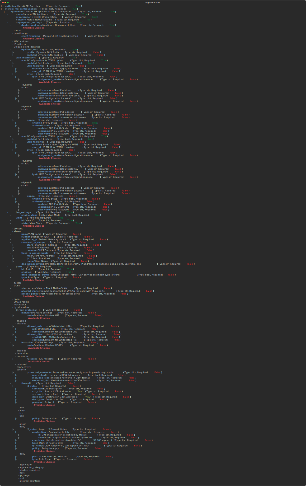

# ansible-argumentspec-parser

Utility to parse Ansible role `meta/argument_specs.yml` file and generate an SVG for documentation purposes.

## Usage

```shell
python parser.py --file <path-to>/argument_specs.yml --output-dir <output-dir>
```

## Sample Output



## Contributors

Nick Thompson <https://github.com/nsthompson>
